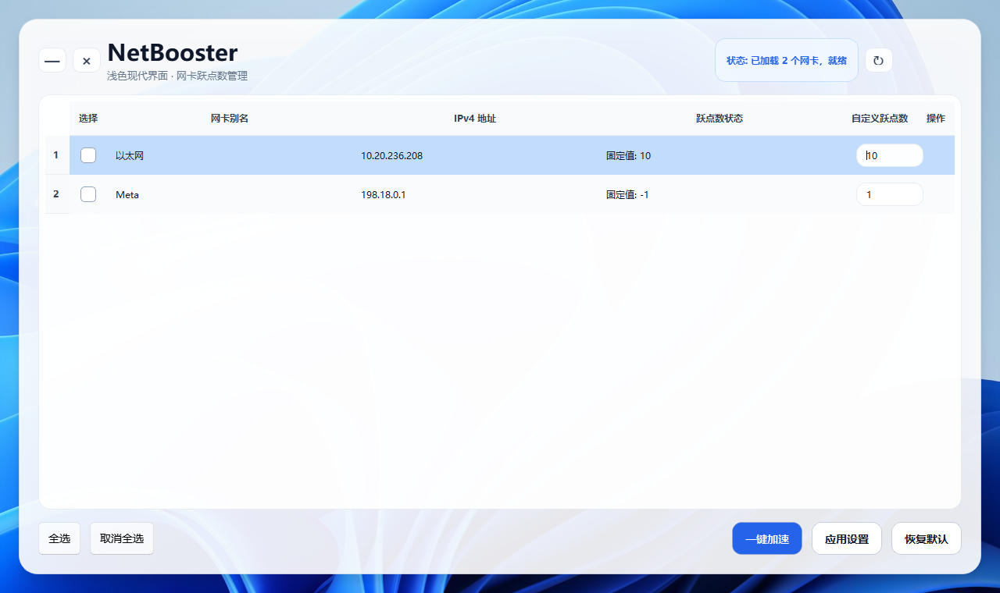

# NetBooster 🚀

<p align="center">
  <a href="#-netbooster---简体中文">简体中文</a> | <a href="#-netbooster---english">English</a>
</p>

---

# 🇨🇳 NetBooster - 简体中文

<p align="center">
  
  
  
  
  
  
</p>

NetBooster 是一款基于 **PySide6** 与 **QFluentWidgets** 开发的现代化 Windows 多网卡并发下载加速工具。

通过动态调度系统的网络接口跃点数（Interface Metric），本工具能够引导多线程下载软件（如 IDM、迅雷、Steam、BT 等）同时利用多条网络线路（例如：以太网 + Wi-Fi + 移动热点），实现带宽叠加与无感加速。同时提供“一键恢复”功能，确保日常使用与电竞游戏时的路由稳定性。

---

## 📷 界面预览

> 📌 **PRO TIP**：请将您的软件运行截图重命名为 `screenshot.png` 并放入项目根目录的 `assets/` 文件夹中，即可在此处正常显示。

<p align="center">
  
</p>

---

## ✨ 核心功能

* 🎨 **现代 Fluent UI 交互**：全面适配 Windows 11 设计语言，支持亚克力毛玻璃特效、原生圆角与平滑过渡动画。
* 🔍 **智能网卡异步扫描**：自动过滤并展示当前系统中**已连接**且**分配有 IPv4 地址**的活动网卡，杜绝失效接口干扰。
* 🚀 **一键并发下载加速**：一键锁定选中网卡的跃点数（预设为 10）并关闭自动跃点，强制多线程流量进行多路负载均衡。
* 💾 **高度自定义 Metric 调节**：支持精细化用户自主配置各张网卡的优先级，按需调整流量配比。
* 🎮 **一键恢复默认（游戏模式）**：快速将所有网卡一键切回 Windows “自动跃点（Automatic Metric）”状态，彻底清理路由干扰，杜绝 FPS 游戏丢包与跳 Ping。

---

## 🛠️ 技术亮点与硬核避坑

* **纯数字标识绑定**：放弃传统的“网卡别名”控制，全链路采用 `InterfaceIndex`（接口索引）作为唯一凭证投喂给系统底层，**完美规避了 Windows 环境下中文字符集引发的 PowerShell 编码乱码与崩溃问题**。
* **多线程异步架构（QThread）**：将所有 PowerShell 路由表读写、底层网络扫描操作完全移出主线程，配合 Qt Signal/Slot 机制驱动 UI 状态机，**即使底层网络阻塞，前端界面依然保持 60 帧丝滑响应**。
* **智能权限生命周期管理**：修改路由表需要系统高级权限。程序启动时采用延迟加载（Lazy Import）机制拦截，未提权时安全触发 Windows UAC 弹窗提权，并**精准锁定当前工作目录**，防止进程重定向至 `System32` 导致相对路径失效。

---

## 📖 工作原理

Windows 系统默认会优先选择跃点数（Metric）较低的网卡传输数据。当多张活动网卡的跃点数被设为完全一致的低数值时，系统底层会激活多路负载均衡。

```
[多线程下载流量] ───►  NetBooster 调度 
                       ├──► 网卡 A (Metric 设为 10) ──► 联通宽带 ──┐
                       ├──► 网卡 B (Metric 设为 10) ──► 电信 Wi-Fi ─┼─► 叠加带宽并发下载
                       └──► 网卡 C (Metric 设为 10) ──► 移动热点 ──┘
```

> ⚠️ **注意**：网卡并发对**单线程 TCP 连接**无效。本工具主要针对 **多线程/多连接** 场景（如 P2P 下载、Steam 游戏更新、分块下载器）。

---

## 📦 快速开始

### 方式 A：源码运行（面向开发者）

**1. 克隆仓库与准备环境**
```bash
git clone [https://github.com/YourUsername/NetBooster.git](https://github.com/YourUsername/NetBooster.git)
cd NetBooster
python -m venv venv
```

**2. 激活虚拟环境**
```bash
# Windows (CMD)
venv\Scripts\activate
# Windows (PowerShell)
.\venv\Scripts\Activate.ps1
```

**3. 安装依赖**
```bash
pip install -r requirements.txt
```

**4. 启动应用**
```bash
python main.py
```

### 方式 B：自行打包发布 `.exe`（面向用户）

推荐使用 `PyInstaller` 将项目打包成无依赖的单文件绿色版：

```bash
pip install pyinstaller
pyinstaller --clean --noconsole --uac-admin --icon=assets/icon.ico --add-data "ui;ui" --add-data "utils;utils" main.py
```

> 💡 **打包关键参数说明**：
> * `--noconsole`：隐藏黑色的后台控制台窗口。
> * `--uac-admin`：让生成的 `.exe` 带有 Windows 官方小盾牌图标，双击直接自动触发 UAC 提权申请。

---

## 🛡️ 免责声明与注意事项

1. **游戏安全提示**：本工具仅通过 Windows 官方 PowerShell API 修改系统标准路由表，**不涉及任何内存注入、游戏封包拦截或篡改行为**，属于 100% 安全的网络优化，绝不触发反作弊封号（如 VAC、BattlEye、DMA 检测等）。
2. **延迟敏感型应用**：并发加速模式会使多网卡分流，这可能导致部分电竞游戏连接握手失败或产生路由抖动。**强烈建议在游玩竞技类游戏前，点击界面右下角的 🎮 [恢复默认] 按钮。**
3. **硬件流量提醒**：当勾选手机无线热点参与加速时，请密切注意移动数据流量消耗。

---

## 📄 开源协议

本项目基于 **LGPL** 开源协议。这意味着您可以自由地使用、修改源码，甚至将其用于闭源商业软件打包分发，唯独在修改本工具核心源码本身时需要开源修改部分。对独立开发者极其友好。

---
---

# 🇺🇸 NetBooster - English

<p align="center">
  
  
  
  
  
  
</p>

NetBooster is a modern Windows multi-network adapter concurrent download acceleration tool developed based on **PySide6** and **QFluentWidgets**.

By dynamically scheduling the network interface metric (Interface Metric) of the system, this tool can guide multi-threaded download software (such as IDM, Thunder, Steam, BT, etc.) to utilize multiple network lines simultaneously (e.g., Ethernet + Wi-Fi + Mobile Hotspot) to achieve bandwidth stacking and seamless acceleration. It also provides a "one-click restore" function to ensure routing stability during daily use and competitive gaming.

---

## 📷 UI Preview

> 📌 **PRO TIP**：Please rename your software running screenshot to `screenshot.png` and place it in the `assets/` folder of the project root directory to display it properly here.

<p align="center">
  
</p>

---

## ✨ Key Features

* 🎨 **Modern Fluent UI Interaction**: Fully adapted to the Windows 11 design language, supporting Acrylic mica effects, native rounded corners, and smooth transition animations.
* 🔍 **Intelligent Asynchronous Adapter Scanning**: Automatically filters and displays active network adapters that are **connected** and **assigned with IPv4 addresses** in the current system, eliminating interference from invalid interfaces.
* 🚀 **One-Click Concurrent Acceleration**: One-click locks the metric of selected adapters (preset to 10) and disables automatic metric, forcing multi-threaded traffic to undergo multi-path load balancing.
* 💾 **Highly Customizable Metric Adjustment**: Supports fine-grained user self-configuration of the priority for each network adapter to adjust traffic distribution on demand.
* 🎮 **One-Click Restore (Game Mode)**: Quickly switches all adapters back to the Windows "Automatic Metric" state with one click, thoroughly clearing routing interference and eliminating packet loss or ping spikes in FPS games.

---

## 🛠️ Technical Highlights & Pitfall Avoidance

* **Pure Numeric Identifier Binding**: Abandoning traditional "Interface Alias" control, the entire link uses `InterfaceIndex` as the unique credential fed to the system underlying layer, **perfectly avoiding PowerShell encoding garbled code and crashes caused by Chinese character sets under Windows environment**.
* **Multi-Threaded Asynchronous Architecture (QThread)**: Moves all PowerShell routing table read/write and underlying network scanning operations completely out of the main thread, cooperating with the Qt Signal/Slot mechanism to drive the UI state machine. **Even if the underlying network is blocked, the front-end interface still maintains a smooth 60 FPS response**.
* **Intelligent Privilege Lifecycle Management**: Modifying the routing table requires elevated system privileges. The program uses a lazy loading (Lazy Import) mechanism to intercept upon startup, safely triggering the Windows UAC pop-up when unauthorized, and **precisely locks the current working directory** to prevent the process from being redirected to `System32`, which causes relative path failures.

---

## 📖 How It Works

By default, Windows prioritizes network adapters with lower metrics for data transmission. When the metrics of multiple active adapters are set to the exact same low value, the underlying system activates multi-path load balancing.

```
[Multi-threaded Traffic] ───►  NetBooster Scheduling
                       ├──► Adapter A (Metric = 10) ──► Line 1 ──┐
                       ├──► Adapter B (Metric = 10) ──► Line 2 ─┼─► Bandwidth Stacking
                       └──► Adapter C (Metric = 10) ──► Line 3 ──┘
```

> ⚠️ **Note**: Adapter concurrency is **ineffective for single-threaded TCP connections**. This tool mainly targets **multi-threaded/multi-connection** scenarios (such as P2P downloads, Steam game updates, chunked downloaders).

---

## 📦 Quick Start

### Method A: Run from Source (For Developers)

**1. Clone Repository & Prepare Environment**
```bash
git clone [https://github.com/YourUsername/NetBooster.git](https://github.com/YourUsername/NetBooster.git)
cd NetBooster
python -m venv venv
```

**2. Activate Virtual Environment**
```bash
# Windows (CMD)
venv\Scripts\activate

# Windows (PowerShell)
.\venv\Scripts\Activate.ps1
```

**3. Install Dependencies**
```bash
pip install -r requirements.txt
```

**4. Launch Application**
```bash
python main.py
```

### Method B: Package into `.exe` (For Users)

We recommend using `PyInstaller` to package the project into a standalone, dependency-free green version:

```bash
pip install pyinstaller
pyinstaller --clean --noconsole --uac-admin --icon=assets/icon.ico --add-data "ui;ui" --add-data "utils;utils" main.py
```

> 💡 **Packaging Parameters Key Notes**:
> * `--noconsole`: Hides the black background console window.
> * `--uac-admin`: Gives the generated `.exe` the official Windows UAC shield icon, automatically triggering the privilege elevation request upon double-clicking.

---

## 🛡️ Disclaimer & Precautions

1. **Gaming Safety Anti-Cheat Note**: This tool only modifies the system standard routing table through the official Windows PowerShell API. It **does not involve any memory injection, game packet interception, or tampering behavior**. It is 100% safe network optimization and will never trigger anti-cheat bans (such as VAC, BattlEye, DMA detection, etc.).
2. **Latency-Sensitive Applications**: Concurrent acceleration mode distributes traffic across multiple adapters, which may cause connection handshake failures or routing jitter in some esports games. **It is strongly recommended to click the 🎮 [Restore Default] button at the bottom right before playing competitive games.**
3. **Hardware Data Warning**: Please pay close attention to your mobile data usage when checking cellular hotspots to participate in acceleration.

---

## 📄 License

This project is licensed under the **LGPL** License. This means you are free to use, modify the source code, and even use it for closed-source commercial software packaging and distribution. The only requirement is that when you modify the core source code of this tool itself, you need to open-source the modified part. Extremely friendly to independent developers.